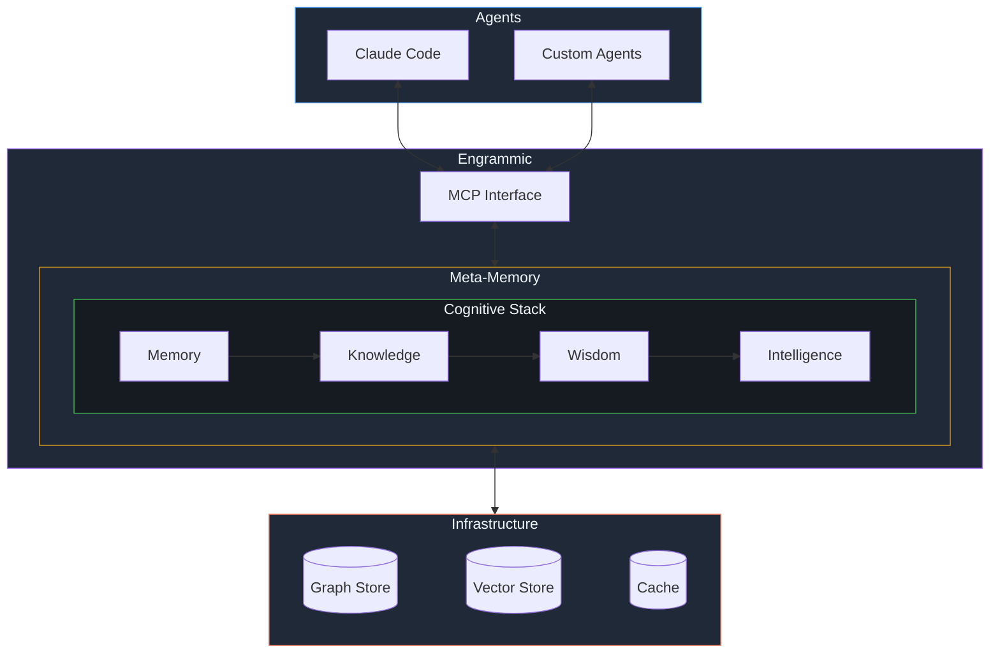

### *Persistence without purpose is just pollution.*

[The Problem](#the-problem) &nbsp;&bull;&nbsp; [Philosophy](#philosophy) &nbsp;&bull;&nbsp; [Cognitive Stack](#the-cognitive-stack) &nbsp;&bull;&nbsp; [Contact](mailto:founders@engrammic.ai)

## The Problem

> *"Current systems create a category error: they apply cognitive decay to factual claims, or treat facts and experiences with identical update mechanics."*
> - [Roynard, 2026](https://arxiv.org/abs/2604.11364)

AI agents forget. Context windows overflow. Facts contradict without reconciliation. This is **context rot** - the systematic degradation of coherent reasoning as operational history grows.

The root cause: applying uniform persistence to fundamentally different types of knowledge. Gaussian decay is correct for experiences. It's wrong for facts.

## Philosophy

We implement [Roynard's four-layer cognitive decomposition](https://arxiv.org/abs/2604.11364) that identifies the missing knowledge layer in cognitive architectures:

| Layer | Persistence Semantics | Examples |
|-------|----------------------|----------|
| **Memory** | Ebbinghaus decay - experiences fade | "User asked about auth on 2026-04-21" |
| **Knowledge** | Indefinite supersession - facts persist until contradicted | "OAuth tokens expire in 30 days" |
| **Wisdom** | Evidence-gated revision - beliefs update on evidence, not time | "This team ships on Fridays" |
| **Intelligence** | Ephemeral inference - per-session working memory | "For this query, I considered A, B, C" |

Different knowledge types require different update mechanics. A fact shouldn't decay like a memory. A pattern shouldn't update like an observation. Contradictions create supersession edges, not silent overwrites.

 

## The Cognitive Stack

<table>
<tr>
<td width="50%">

### Memory
*Experiences that fade*

```mermaid
flowchart LR
    subgraph MEMORY["Memory Layer"]
        direction TB
        P[Passages] --> G[(Graph)]
        V[Events] --> G
        U[Utterances] --> G
        G --> S[(Vectors)]
    end
    
    style MEMORY fill:#0d1117,stroke:#58a6ff
```

Raw experience storage: passages, events, utterances. Ebbinghaus decay - experiences fade with time.

</td>
<td width="50%">

### Knowledge
*Facts that persist*

```mermaid
flowchart LR
    subgraph KNOW["Knowledge Layer"]
        direction TB
        C[Claims] --> F[Facts]
        CI[Citations] --> F
        F --> G[(Graph)]
    end
    
    style KNOW fill:#0d1117,stroke:#a371f7
```

Extracted claims promoted to facts. Indefinite supersession - facts persist until contradicted, not until they age.

</td>
</tr>
<tr>
<td width="50%">

### Wisdom
*Beliefs that revise*

```mermaid
flowchart LR
    subgraph WISDOM["Wisdom Layer"]
        direction TB
        P[Patterns] --> H[Hierarchies]
        H --> B[Beliefs]
        B --> S[Summaries]
    end
    
    style WISDOM fill:#0d1117,stroke:#3fb950
```

Graph clustering surfaces emergent patterns. Beliefs update on evidence shift, not on time.

</td>
<td width="50%">

### Intelligence
*Ephemeral reasoning*

```mermaid
flowchart LR
    subgraph INTEL["Intelligence Layer"]
        direction TB
        Q[Query] --> R[ReasoningChain]
        R --> CR[Crystallizations]
        CR --> K[(Knowledge)]
    end
    
    style INTEL fill:#0d1117,stroke:#f78166
```

Per-session reasoning chains. Ephemeral by design - only crystallized conclusions survive the session.

</td>
</tr>
</table>

 

### Meta-Memory
*Provenance, time-travel, reflection*

```mermaid
flowchart LR
    subgraph META["&nbsp;&nbsp;Meta-Memory&nbsp;&nbsp;"]
        direction LR
        P[Provenance] --> T[Time-Travel]
        T --> R[Reflection]
        R --> H[History]
    end
    
    style META fill:#0d1117,stroke:#d29922
```

Cross-cutting capability spanning all four layers. Enables metacognition:
- **Provenance**: "Why do I believe X?" - full citation chain to source
- **Time-travel**: "What did I know last Tuesday?" - query historical state
- **Reflection**: Agents store observations about their own cognition

Bi-temporal tracking means every fact knows *when it was true* vs *when we learned it*.

 

### System Architecture

 

## Get Started

| Repository | Purpose |
|------------|---------|
| [primitives](https://github.com/engrammic-ai/primitives) | EAG schema library (Apache 2.0) |
| [engine](https://github.com/engrammic-ai/engine) | Local engine, no cloud required (Apache 2.0) |
| [mcp](https://github.com/engrammic-ai/mcp) | MCP client for hosted service |

*Closed beta now open. [Join the waitlist](https://engrammic.ai) or [reach out](mailto:founders@engrammic.ai) for access.*

---

  

  <i>"Memory without meaning is just metadata."</i>

  Engrammic &bull; 2026

